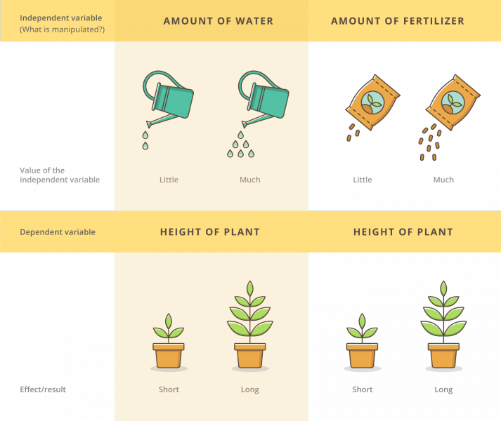

```{r setup, include=FALSE}
options(htmltools.dir.version = FALSE)
library(tidyverse)
theme_set(theme_dark())
library(ggrepel)
library(xaringanExtra)
use_xaringan_extra(c("panelset", "tachyons"))
```

.center[

]

???

**Independent variables**: the variables that are manipulated, the effect of which we are interested in.

**Dependent variable**: the variable affected by the independent variables.

These are also called (more transparently) **predictors** and **outcome** respectively.

**TASK 1**. Have a look at the figure in this slides and try to come up with an example using linguistic data (any kind of data will do) that has the same structure of the figure (i.e. two independent variables/predictors and one dependent variable/outcome).

<br>

.f6[Image from <https://www.pngkit.com/bigpic/u2r5o0u2t4r5o0e6/>]

---

```{r data, echo=FALSE, message=FALSE, warning=FALSE, out.height="600px", fig.align='center'}
elp <- read_csv("data/ELP_frequency.csv")

elp %>%
  ggplot(aes(log(Freq), RT, label = Word)) +
  geom_point(size = 5, colour = "yellow") +
  geom_smooth(method = "lm", colour = "white") +
  geom_label_repel(size = 20 /.pt) +
  theme(text = element_text(size = 26))
```

???

This is the same data that you saw during the lecture on Tuesday.

It's from a lexical decision task, where participants had to say whether the word on the screen was a real or a nonce word.

Real words differed by lexical frequency. 

**Predictor**: Logged lexical frequency, `log(Freq)`.

**Outcome**: Reaction Time, `RT`.

**TASK 2**: What happens to reaction times (*outcome*) when we change the logged lexical frequency (*predictor*)?

---

# Formal notation

<br>

.center[.f1[.green[RT] ~ .purple[log(Freq)]]]

--

<br>

.center[.f1[.green[*outcome*] ~ .purple[*predictor*]]]

<br>

The tilde `~` can be read as 'as a function of'.

???

.green[Reaction time] *as a function of* .purple[log frequency].

---

# Formal notation

<br>

.center[.f1[.green[RT] ~ .purple[log(Freq) + W_length + ...]]]

<br>

There can be many predictors.

???

There can be many predictors, not just one.

In this example I have added word length `W_length`.

In fact there can also be more than one outcome variable. Models with more than one outcome variable are called *multivariate* models. But you can safely ignore this, since it is very unlikely that you will need to use a multivariate model.

**CHALLENGE 1**: In the previous example, with only `RT` and `log(Freq)` we used a [scatter plot](https://chartio.com/learn/charts/what-is-a-scatter-plot/). In this example we have one outcome and two predictors. They are all continuous predictors. Challenge yourself and think about which type of graph might be suitable to show the three variables in one single plot. You can find inspiration here: <https://plotly.com/r/statistical-charts/>. 

<br>

.f6[NOTE: Linear regressions with one predictor are called *simple* linear regressions, while those with more than one predictor are called *multiple* or *multivariable* linear regressions. You don't have to remember this in order to be able to use linear models. They all work the same.]

---

.pull-left[
<br>

.f1[It is *very* important to think carefully about the type of outcome variable you have to analyse.]
]

.pull-right[
.center[]
]

???

We won't go into the technical details, but the specific type of linear model you can use to analyse your data depends on the type of outcome variable.

The next slide talks about different types of outcome variables you might encounter/need to analyse.

<br>

.f6[EXTRA: If you *are* curious about the technicalities, you can have a read here: https://stefanocoretta.github.io/post/2021-08-21-regression-models-a-cheat-sheet/ You need to have a basic understanding of probability distributions in order to get the most out of the post.]

.f6[Photo by <a href="https://unsplash.com/@rifhdyt?utm_source=unsplash&utm_medium=referral&utm_content=creditCopyText">Arif Hidayat</a> on <a href="https://unsplash.com/s/photos/hedgehog?utm_source=unsplash&utm_medium=referral&utm_content=creditCopyText">Unsplash</a>]

---

class: smaller-font

# Types of outcome variables

.panelset[
.panel[.panel-name[Numeric]

**Numeric variables** are... just numbers.

There are two major types of numeric variables. Variables that can take on positive and negative numbers and variables that only take on positive numbers.

- Positive and negative numbers (they can include 0).

  - Decibel (dB).
  
  - Log frequencies.

- Only positive numbers (they generally cannot be 0).

  - Duration of speech units (segments, gestures, syllables, words, sentences, etc).
  
  - Hertz (f0 and formant frequencies).

]

.panel[.panel-name[Count]

**Count variables** are simply counts of something.

For example:

- Number of hits in a corpus.

- Number of occurrences of Double Object construction vs Indirect Object construction.

- Number of VO vs OV languages.

- Number of hand-pointing gestures.

- Number of hesitations.

- Any count of something...

]

.panel[.panel-name[Ordered scales]

**Ordered scales** are any scale in which each level or point follows a specific order.

- Any numbered scale (Likert, 0-10, 0-5, etc).

- Ratings.

  - Acceptability judgments.

  - Language attitude rating.

]

.panel[.panel-name[Binary]

A **binary** variable is a variable with two levels like yes/no or true/false.

Examples:

- Yes/no.

- Right/wrong.

- True/false.

- Real word/nonce word.

- Anything that can be conceptualised as "0 vs 1" or "ABSENT vs PRESENT".

]

.panel[.panel-name[Categorical]

**Categorical variables** are unordered groups of 2 or more levels. They are **unordered** because, differently from ordered scales, the order of the levels in the variable doesn't really matter.

- Location: North/Center/South.

- Age group: Young/adult.

- Gender: Non-binary/fluid/female/male.

]

.panel[.panel-name[Other]

There are other types of variables that do not fall into the previous categories.

- Time series:

  - f0 or formant measurements taken at several time points within a vowel.
  - Longitudinal data of child speech productions.

- Coordinates:

  - Geographic coordinates of tweets.

- Images:

  - Ultrasound tongue imaging or MRI.

- Much more...

]

]

???

Use the left/right arrows to move from one panel to the other, or click on the panel name.

---

class: middle center inverse

# Final exercise

???

**TASK 3**: Pick three types of outcome variables and think about a couple extra examples of linguistic data for each type.
