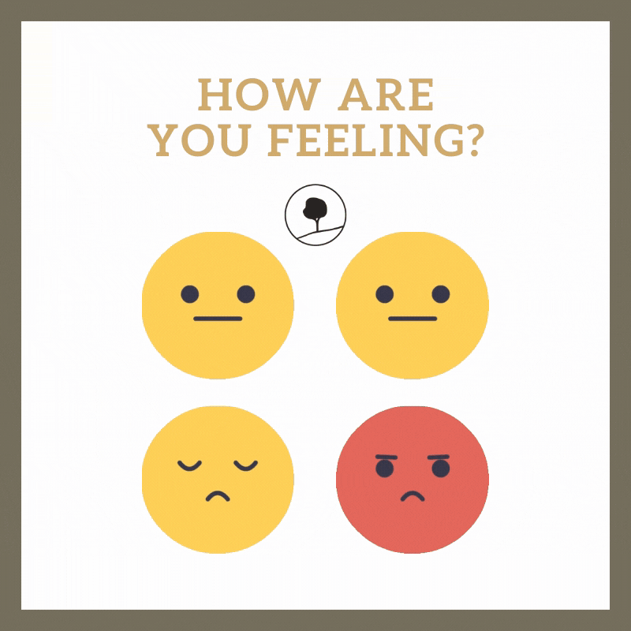
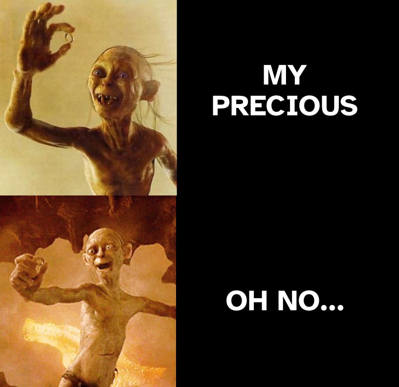
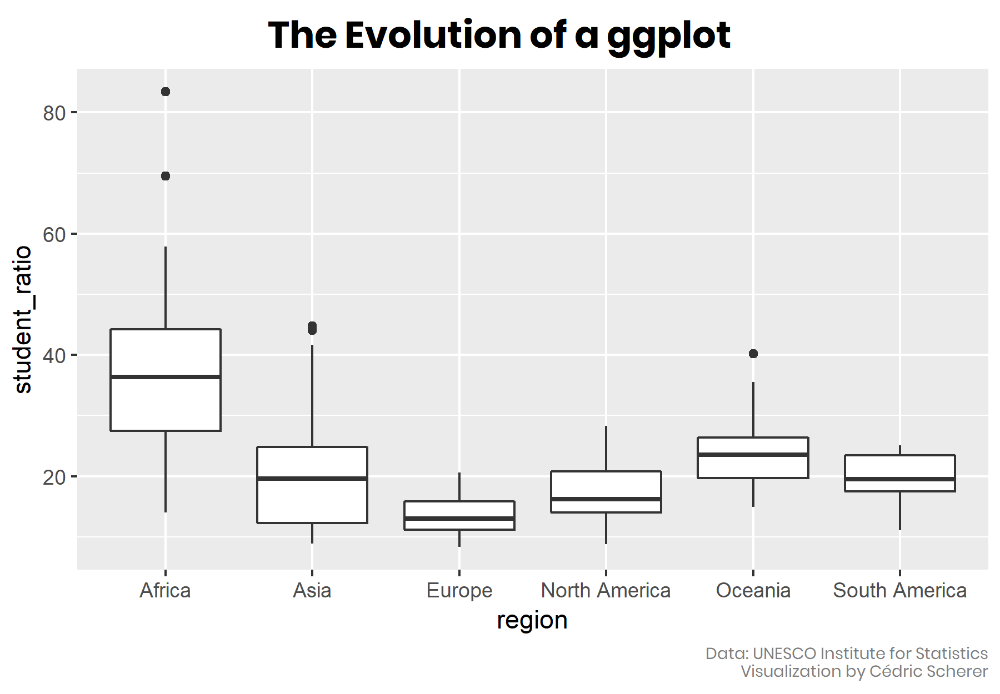
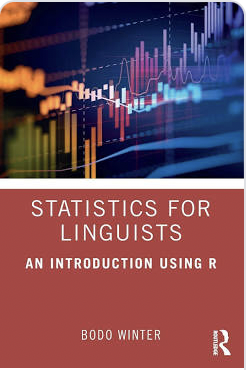

```{r setup, include=FALSE}
options(htmltools.dir.version = FALSE)
library(tidyverse)
theme_set(theme_dark())
library(xaringanExtra)
use_xaringan_extra(c("panelset", "tachyons"))
```

class: inverse
background-image: url(img/who-am-i.jpg)

---

class: inverse

# Who am I?

.pull-left[
.f1[Stefano]

.f3[[ˈstefano], or [ˈstɛfnəʊ]]

<br>

<https://stefanocoretta.github.io>

<https://twitter.com/StefanoCoretta>
]

--

.pull-right[
.f2[Joined LEL last this month!]

<br>

.f2[*Senior Teaching Coordinator for Statistics*]
]

---

class: center middle



???

Slido poll 

---

class: center, middle


???

What is knowledge?

What does "knowledge" mean to you?

---

background-image: url(img/word-cloud.png)
background-size: cover

???

Results from Slido poll.

Where does knowledge come from?

---

# Sources of knowledge

.center[

]

???

One way of classifying sources of knowledge:

- Authority

- Intuition

- Reason (logic)

- Observation.

---

# Sources of knowledge

.center[

]

???

Observations generate **empirical data**.

*Empirical* just means 'based on experience', where *experience* here means 'observation'.

How can we use observations/empirical data?

NOTE: Do not mix up empirical methods with experimental methods. Experiments are a kind of empirical method.

EXTRA: Check out the etymology of the word *empiric(al)* here: <https://en.wiktionary.org/wiki/empiric#English>

---

# Empirical method 

.center[

]

???

We have a question about something.

Let's imagine that this something is the population of British Sign Language signers.

We want to know whether the cultural background of the BSL signers is linked to different pragmatic uses of the sign for BROTHER.

But we can't survey the entire population of BSL signers.

NOTE: *Population* can be a set of anything, not just a specific group of people. For example, the words in a dictionary can be a "population"; or the antipassive constructions of Austronesian languages; or ...

---

# Empirical method 

.center[

]

???

We take a **sample** from the population.

This is our empirical data (the product of observation).

How do we go from data/observation to answering our question?

We can use **inference**.

**Inference** is the process of understanding something about a population based on the sample (aka the data) taken from that population.

---

class: middle center inverse

# Inference is not infallible

???

However, inference based on data does not guarantee that the answers to our questions are right/true.

In fact, any observation we make comes with a degree of **uncertainty and variability**.

EXTRA: Check out this article: <https://www.scientificamerican.com/article/if-you-say-science-is-right-youre-wrong/>

EXTRA: Find out about Popper's view of falsification and fallibilism.

---

class: inverse

# Uncertainty and variability

.center[

]

???

So we have to deal with:

- Uncertainty in any one observation of a phenomenon.

- Variability among different observations of the same phenomenon.

---

class: center middle inverse

# ENTER<br>STATISTICS

???

Statistics helps us quantifying uncertainty and variability.

---

  .pull-left[

<br>

<br>

.f1[What is statistics?]
]

.pull-right[


]

???

Slido poll.

EXTRA: Check out the etymology of *statistics* here: <https://en.wiktionary.org/wiki/statistics#Etymology_1>.

Photo by <a href="https://unsplash.com/@charlesdeluvio?utm_source=unsplash&utm_medium=referral&utm_content=creditCopyText">Charles Deluvio</a> on <a href="https://unsplash.com/s/photos/dog?utm_source=unsplash&utm_medium=referral&utm_content=creditCopyText">Unsplash</a>

---

# What is statistics?

- Statistics is the **science** concerned with developing and studying methods for collecting, analyzing, interpreting and presenting empirical data. (From [UCI Department of Statistics](https://www.stat.uci.edu/what-is-statistics/))

--

- Statistics is the **technology** of extracting information, illumination and understanding from data, often in the face of uncertainty. (From the [British Academy](https://www.thebritishacademy.ac.uk/blog/what-is-statistics/))

--

- Statistics is a **mathematical and conceptual** discipline that focuses on the relation between data and hypotheses. (From the [Standford Encyclopedia of Philosophy](https://plato.stanford.edu/entries/statistics/))

--

- Statistics as the **art** of applying the science of scientific methods. (From [ORI Results](https://www.oriresults.com/articles/blog-posts/the-art-of-statistics/), [Nature](https://www.nature.com/articles/d41586-019-00898-0))

---

# What is statistics?

> **Statistic is both a science and an art**.
>
> It is a **science** in that its methods are basically systematic and have general application and an **art** in that their successful application depends, to a considerable degree, on the skill and special experience of the statistician, and on his knowledge of the field of application.

—L. H. C. Tippett

---

class: middle

.pull-left[
.f1[But... "all that glisters is not gold"]
]

.pull-right[

]


---

# Case study: Many Analysts, One Data Set

.pull-left[
.center[

]
]

.pull-right[
- .f3[29 independent analysis teams.]

- **Is there a link between player skin tone and number of red cards in soccer?**

- 69% of the teams reported an effect, and 31% did not.

- 21 unique types of statistical analysis.

<br>

> The observed results from analyzing a complex data set can be highly contingent on **justifiable**, but **subjective**, analytic decisions.

—Silberzahn et al 2018

]

---

class: center middle inverse

# BREAK


---

# How do you do statistics?

<br>

.pull-left[
.center[

]
]

<br>

.pull-right[
.f1[**Making sense of the data**, while recognising uncertainty and variability.]
]

???

Statistics is about **making sense of the data** in light of the questions we asked.

It is also about recognising and embracing uncertainty about outcomes and variability.

EXTRA: If you want to dig deeper into uncertainty, why it is helpful and how to embrace it, have a look at this article: <https://doi.org/10.1515/ling-2019-0051> by Vasishth and Gelman.

---

class: center middle inverse

<span style="font-size: 4em">Statistics is <u>not</u> maths</span>

???

Statistics is not maths.

There are numbers and a few formulas, but basic arithmetic is sufficient to be able to **do** statistics.

---

# Data analysis process: make sense of the data


???

**Data analysis** is the process of working with data to discover and understand patterns (or absence of patterns), with the goal of better understanding a particular phenomenon.

---

# Data viz

.center[

]

???

**Data visualisation** is about making the data talk.

Source: <https://www.cedricscherer.com/tags/ggplot-evolution/>

---

# Data analysis process: make sense of the data


---

# What is a (statistical) model?

<br>

.f1[A **model** is a quantitative representation of the population that generated the data sample.]

---

# Statistical models

.f2[All models are wrong, **some are useful**.]

--

.f2[or as I like saying: All models are wrong, **some are less wrong than others**.]

--

<br>

Because of uncertainty and variation, models are an **approximation** of the real-world.

We can only **estimate** the quantitative representation of a phenomenon.

---

# A versatile and simple model: The Line

```{r data, echo=FALSE, message=FALSE, warning=FALSE, out.height="400px", fig.align='center'}
elp <- read_csv("data/ELP_frequency.csv")

elp %>%
  ggplot(aes(log(Freq), RT)) +
  geom_point(size = 5, colour = "yellow") +
  theme(text = element_text(size = 26))
```

---

# A versatile and simple model: The Line

```{r line, echo=FALSE, message=FALSE, warning=FALSE, out.height="400px", fig.align='center'}
elp %>%
  ggplot(aes(log(Freq), RT)) +
  geom_point(size = 5, colour = "yellow") +
  geom_smooth(method = "lm", colour = "white") +
  theme(text = element_text(size = 26))
```


---

# A versatile and simple model: The Line

- *Linear regression models*, or simply **LINEAR MODELS**.

- Linear models can be used for virtually **any type of data**.

--

.pull-left[
This means that once you learn how to run a linear model, you can use it with anything.
]

.pull-right[

]

???

Photo by <a href="https://unsplash.com/@ilypnytskyi?utm_source=unsplash&utm_medium=referral&utm_content=creditCopyText">Igor Lypnytskyi</a> on <a href="https://unsplash.com/s/photos/bicycle?utm_source=unsplash&utm_medium=referral&utm_content=creditCopyText">Unsplash</a>
  
---

# Resources

.pull-left[
.center[

]
]

.pull-right[
Excellent **beginners textbook** for linguistics students.

What I like about it:

- It uses R.

- There's very little maths in it.

- It teaches one thing (linear models) and it does it well.

- It has a fresh take on research.
]

---

# Resources

- R for Data Science (<https://r4ds.had.co.nz>).

- intRo: Data visualisation with R (<https://intro-rstats.github.io>).

  - Online workshop, Nov 16-17 and 19.

--

- PPLS Skills Centre <https://uoe.sharepoint.com/sites/PPLSLearningResources>

- **JUNE 2022**
  - 3 hour crash course on linear models.
  - *Previous knowledge of R required*.

---

class: center middle inverse

# THE END


???

Photo by <a href="https://unsplash.com/@jasanmiguel?utm_source=unsplash&utm_medium=referral&utm_content=creditCopyText">Ja San Miguel</a> on <a href="https://unsplash.com/s/photos/dog?utm_source=unsplash&utm_medium=referral&utm_content=creditCopyText">Unsplash</a>
