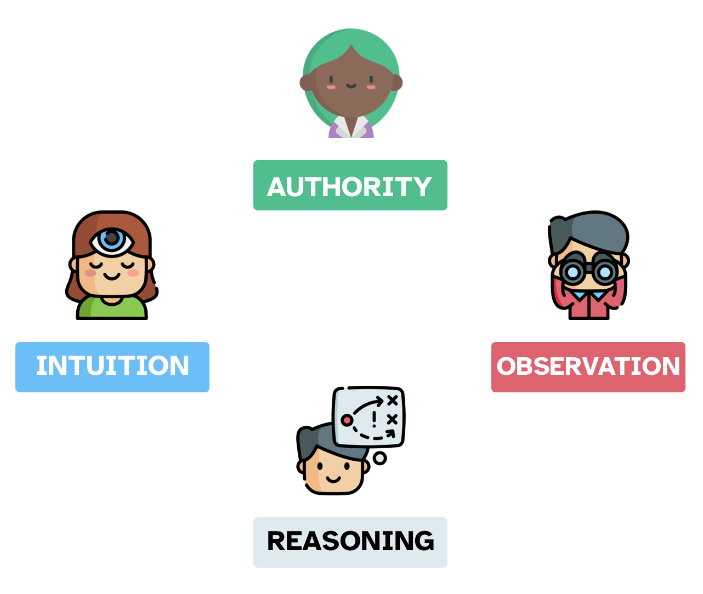
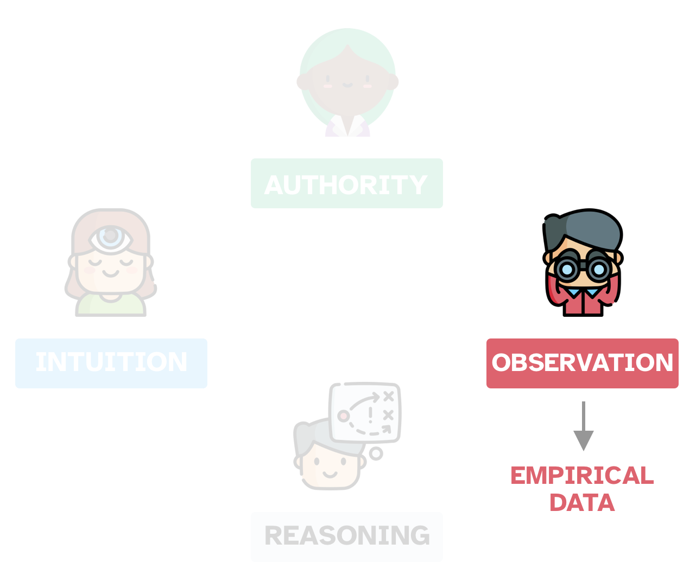
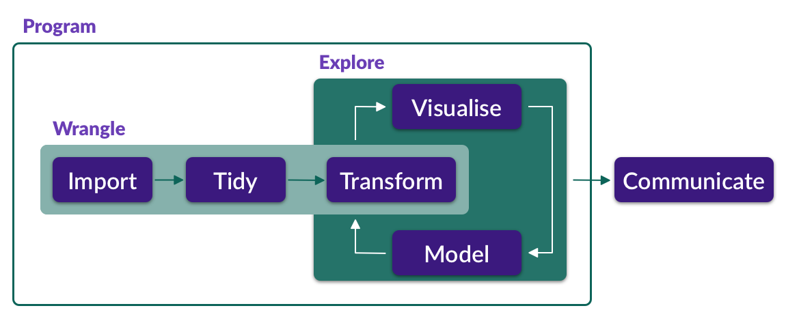

```{r setup, include=FALSE}
options(htmltools.dir.version = FALSE)
library(tidyverse)
library(xaringanExtra)
use_xaringan_extra(c("panelset", "tachyons"))
```

class: inverse
background-image: url(img/who-am-i.jpg)

---

class: inverse

# Who am I?

Stefano [ˈstefano]/[ˈstɛfnəʊ]


---

# How do you feel today?

.center[<iframe src="https://wall.sli.do/event/hbcigzia?section=6c613f12-b61e-4f61-90a9-291ee28c25af" width="700" height="400"></iframe>]

---

class: center, middle


???

What is knowledge?

What does "knowledge" mean to you?

Where does knowledge come from?

---

# Sources of Knowledge

.center[

]

---

# Sources of knowledge

.center[

]

???

*Empirical* just means 'based on observation'.

Check out the etymology of the word *empiric(al)* here: <https://en.wiktionary.org/wiki/empiric#English>

Do not mix up empirical methods with experimental methods. Experiments are a kind of empirical method.

How does the process look like?

---

# Inference

.center[

]

???

We want to answer a question about something.

From observation to an answer using inference.


---

class: inverse

# Uncertainty and variability

.center[<a href="https://www.azquotes.com/quote/827060" title="Pliny the Elder quote"></a>]

???

Dealing with uncertainty in the observation.

Dealing with variability among observations of the same phenomenon.

---

# WHAT IS STATISTICS?

.center[<iframe src="https://wall.sli.do/event/hbcigzia?section=6c613f12-b61e-4f61-90a9-291ee28c25af" width="700" height="400"></iframe>]

---

# What is statistics?

- Statistics is the **science** concerned with developing and studying methods for collecting, analyzing, interpreting and presenting empirical data. (From [UCI Department of Statistics](https://www.stat.uci.edu/what-is-statistics/))

--

- Statistics is the **technology** of extracting information, illumination and understanding from data, often in the face of uncertainty. (From the [British Academy](https://www.thebritishacademy.ac.uk/blog/what-is-statistics/))

--

- Statistics is a **mathematical and conceptual** discipline that focuses on the relation between data and hypotheses. (From the [Standford Encyclopedia of Philosophy](https://plato.stanford.edu/entries/statistics/))

--

- Statistics as the **art** of applying the science of scientific methods. (From [ORI Results](https://www.oriresults.com/articles/blog-posts/the-art-of-statistics/), [Nature](https://www.nature.com/articles/d41586-019-00898-0))

---

# What is statistics?

> **Statistic is both a science and an art**.
>
> It is a **science** in that its methods are basically systematic and have general application and an **art** in that their successful application depends, to a considerable degree, on the skill and special experience of the statistician, and on his knowledge of the field of application.

—L. H. C. Tippett

---

# But... All that glisters is not gold

Statistics can be misused.

Science Apocalypse

---

# Scientific crisis

Reproducibility

Replicability

Generalisability

(Robustness)

---

# How do you do statistics?

- You deal with uncertainty.

- You deal with variation.

---

# How do you do statistics?



???

In other words, how do you do data analysis?

---

Data visualisation and modelling

---

# Data viz

---

# Modelling (and testing)

All models are wrong, some are less wrong than others.

Uncertainty and variation => ESTIMATION.

---

# One model to fit them all

Linear regression models

or simply Linear models

---

[data from Bodo's book]

# Fit a line

```{r}

```

---

# Give me a line and I will model the world

Linear models can be used for virtually any type of data.

Once you learn how to run a linear model, you can use it with anything.

---

# Types of outcome data


.panelset[
.panel[.panel-name[Numeric]

- Positive and negative numbers (can be 0).

  - Decibel (dB).
  
  - Log frequencies.

- Only positive numbers (cannot be 0).

  - Duration of speech units (segments, gestures, syllables, words, sentences, etc)
  
  - Hertz (f0 and formant frequencies).

]

.panel[.panel-name[Count]

- Number of hits in a corpus.

- Number of occurrences of Double Object construction vs Indirect Object construction.

- Number of VO vs OV languages.

- Number of hand-pointing gestures.

- Number of hesitations.

- Any count of something...

]

.panel[.panel-name[Ordered scales]

- Any numbered scale (Likert, 0-10, 0-5, etc).

- Ratings.

  - Acceptability judgments.

  - Language attitude.

]

.panel[.panel-name[Binary]

- Yes/no.

- Right/Wrong.

- True/false.

- Real word/nonce word.

- Anything that can be conceptualised as 0 vs 1.

]

.panel[.panel-name[Categorical]

Unordered groups of 2 or more levels.

- North/Center/South.

- Young/Adult.

- Non-binary/Fluid/Female/Male.

]

.panel[.panel-name[Other]

- Time series

- Coordinates

- Images

- Much more...

]

]

???

Traditionally the types are different, but for practical and pedagogical purposes I prefer this list.

---

# Probability distribution of the outcome


---

# Open Science 
